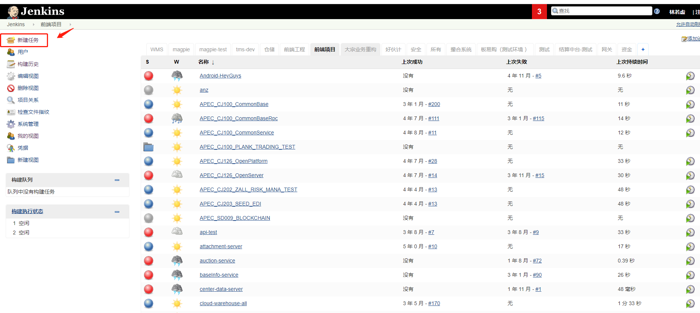
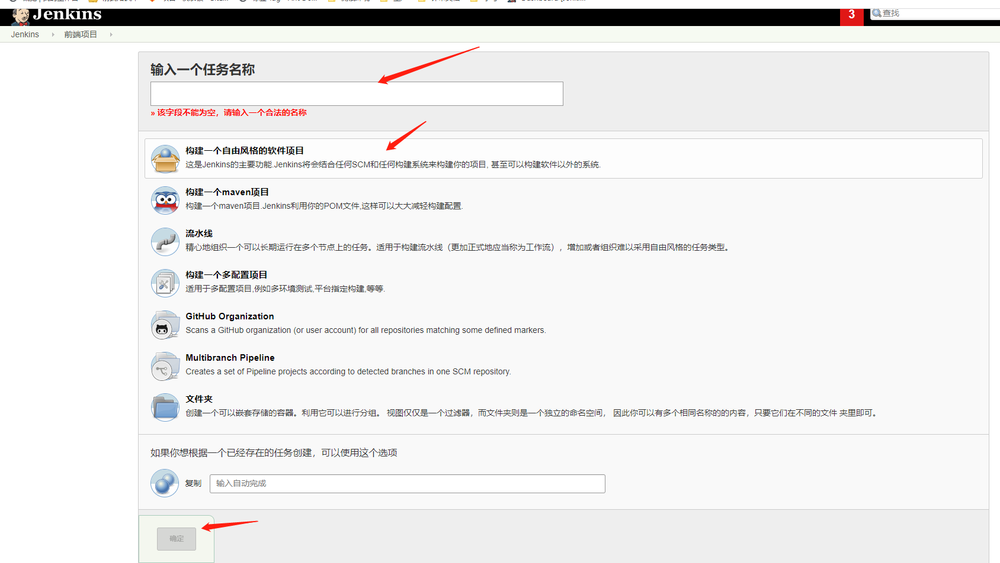
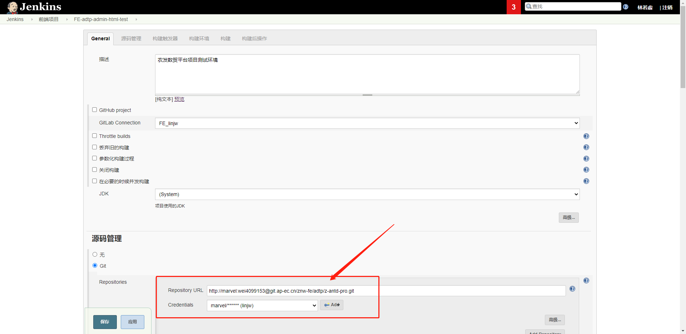
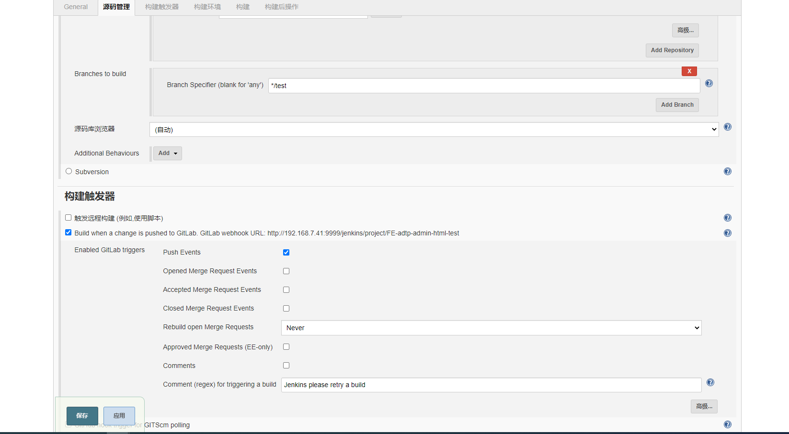
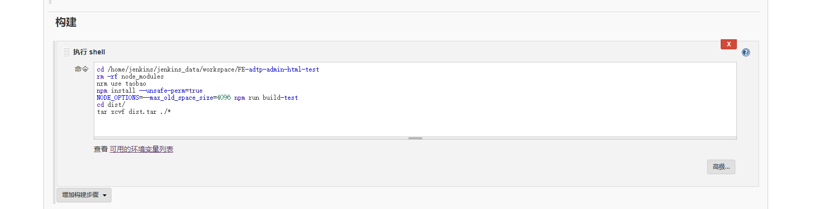
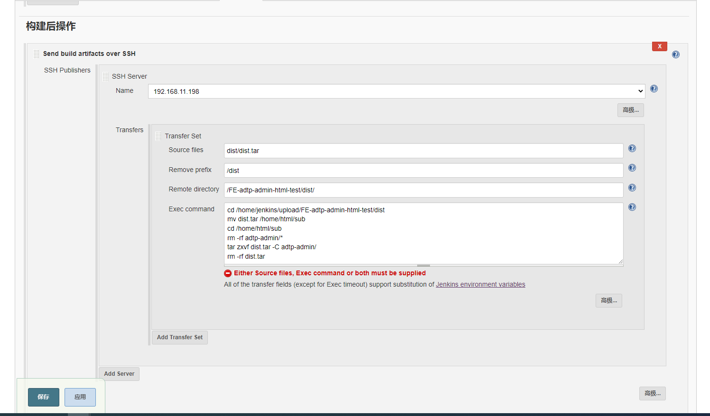
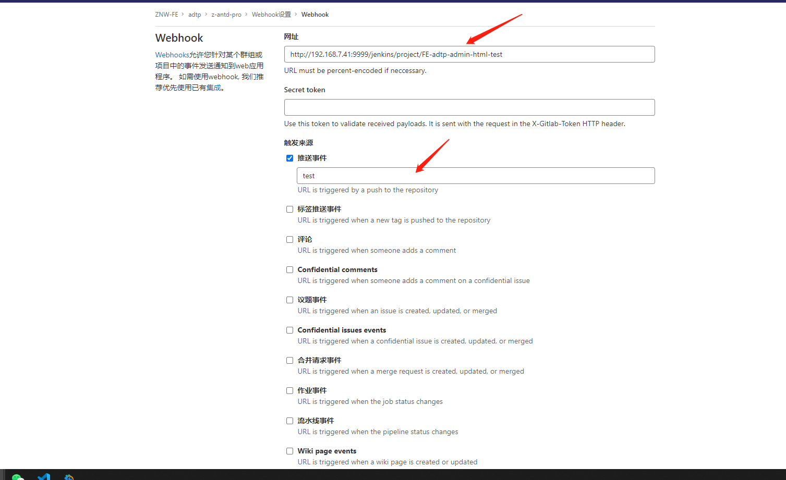

# jenkins与gitlab自动化部署

## 需求目的

- 项目发测试环境时，每次都需要手动打包，然后把打包文件通过`xftp`放入对应文件夹下，很麻烦，而且由于手动，是容易出错的！！！
- 为此，需要通过自动化工具，使得当`test`分支的代码上传时，自动触发打包，之后自动帮我们放到对应的目录文件夹下，这样就实现自动化打包了！

## 操作流程

### 1.Jenkins新建任务



- 点进去之后是这样一个页面



- 填一个任务名，选择`自由风格的`，之后点击确定就行了

### 2.Jenkins进行相关配置



- 这里的`Repository URL`需要注意不是git的那个地址，需要在前面加上用户信息



- 分支信息需要填写哪个分支提交触发这个任务

- `触发器`这里有这样一段话`GitLab webhook URL: http://192.168.7.41:9999/jenkins/project/FE-adtp-admin-html-test`，这个意思是需要你在gitlab项目里面进行配置，这个暂时放着，等下再弄！！！

- 只勾选`Push Events`代表push的时候触发



- 这里构建里面`增加构建步骤`里面有个`执行shell`选择这个

```shell
cd /home/jenkins/jenkins_data/workspace/FE-adtp-admin-html-test
rm -rf node_modules
nrm use taobao
npm install --unsafe-perm=true
NODE_OPTIONS=--max_old_space_size=4096 npm run build-test
cd dist/
tar zcvf dist.tar ./*
```
- shell命令，自行体会，`tar zcvf dist.tar ./*`这句话的意思是打成`tar`的压缩包



- `增加构建后操作步骤`里面选择`Send build artifacts over SSH`
- `Name`里面选择打包文件需要放的服务器
- `Source files`是源文件的目录
- `Remove prefix`是源文件删除的目录
- `Remote directory`是需要放到的目标文件路径
- `Exec command` 这个是额外的脚本内容（重点）

```shell
cd /home/jenkins/upload/FE-adtp-admin-html-test/dist
mv dist.tar /home/html/sub
cd /home/html/sub
rm -rf adtp-admin/*
tar zxvf dist.tar -C adtp-admin/
rm -rf dist.tar 
```

- 自行理解，`tar zxvf dist.tar -C adtp-admin/`这段话是解压缩文件

### 3.gitlab进行相关配置

到上面两步，基本上就可以了，但是尝试后发现可以手动构建，但是`push`代码后不会自动触发，原因是`gitlab`里面需要在`设置`里设置`webhooks`



- 这里的网址填写前面`GitLab webhook URL: http://192.168.7.41:9999/jenkins/project/FE-adtp-admin-html-test`这段话中的网址就行，即`http://192.168.7.41:9999/jenkins/project/FE-adtp-admin-html-test`这个，`推送事件`填写分支`test`，然后保存就可以了

## 大功告成

- 这样就可以愉快的写代码然后push到测试环境，会自动打包了，妈妈再也不用担心文件夹路径放错啦！nice~