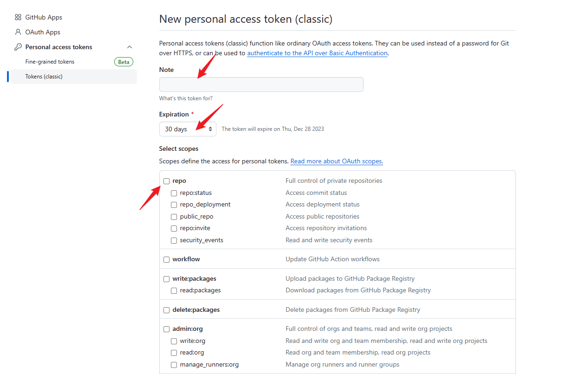
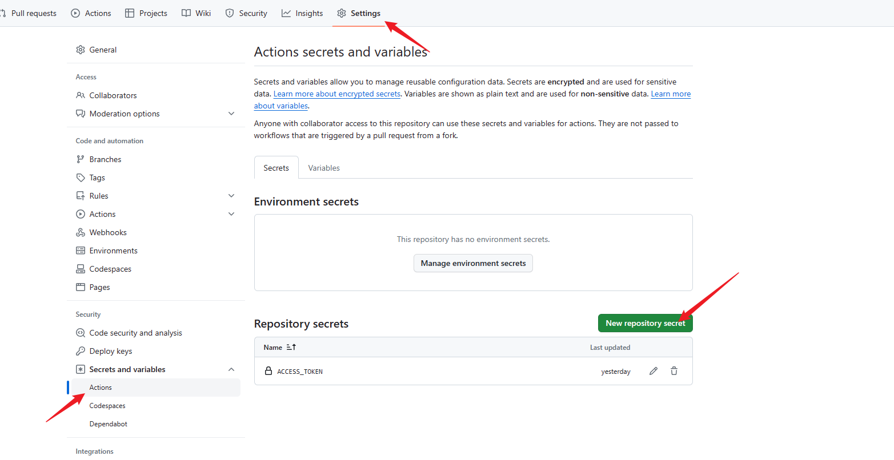
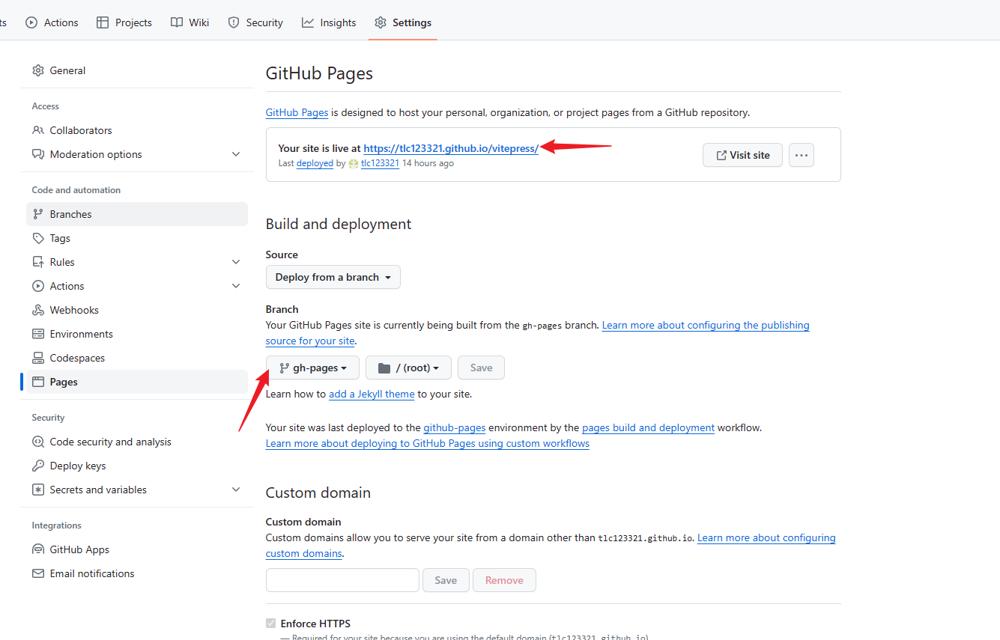
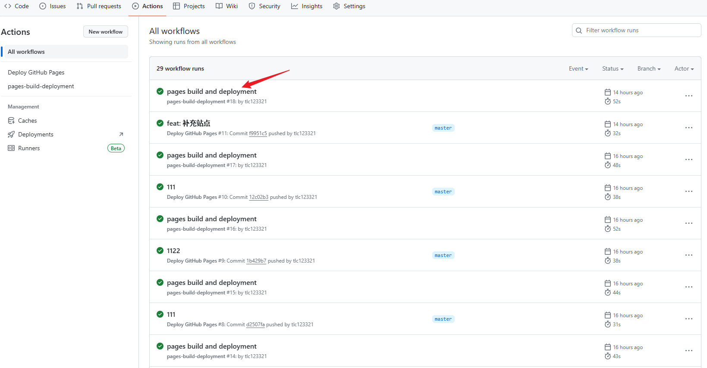

# github部署vitepress

## 参考资料

同事的博客：[使用gitbub Pages 部署 VitePress](https://libraheresy.github.io/site/blog/%E4%BD%BF%E7%94%A8_GithubPages_%E9%83%A8%E7%BD%B2_VitePress)

## 步骤

### 1.新建仓库
在github上新建一个仓库，这里随便命名，比如叫做`vitepress-demo`

### 2.推送代码
github项目拉取下来，代码放进去，然后推送到远程仓库

### 3.获取token
点击右上角的头像，`Settings` -> `Developer settings` -> `Personal access tokens` -> `Tokens(classic)` -> `Generate new token`
这里目前新版的有个beta版本的，我用的老版本的

1. Note里面随意填写
2. 时效Expires选择`No expiration`
3. 勾选上`repo`
4. 保存之后会生成一个`token`，`token`自己记住，可以放在项目里面保存，后续需要用到


5. 进入此项目，点击 `Secrets and variables` -> `Actions` -> `New repository secret`，`Name`填`ACCESS_TOKEN`，`Value`填刚才获取到的`token`

### 4.新建github action
在项目根目录新建`.github/workflows/main.yml`文件，内容如下：
```yml
# name 可以自定义
name: Deploy GitHub Pages

# 触发条件：在 push 到 main/master 分支后，新的 Github 项目 应该都是 main，而之前的项目一般都是 master
on:
  push:
    branches:
      - master

# 任务
jobs:
  build-and-deploy:
    # 服务器环境：最新版 Ubuntu
    runs-on: ubuntu-latest
    steps:
      # 拉取代码
      - name: Checkout
        uses: actions/checkout@v2
        with:
          persist-credentials: false

      # 生成静态文件
      - name: Build
        run: npm install -g yarn && yarn && yarn docs:build

      # 部署到 GitHub Pages
      - name: Deploy
        uses: JamesIves/github-pages-deploy-action@releases/v3
        with:
          ACCESS_TOKEN: ${{ secrets.ACCESS_TOKEN }} # 也就是我们刚才生成的 secret
          BRANCH: gh-pages # 部署到 gh-pages 分支，因为 main 分支存放的一般是源码，而 gh-pages 分支则用来存放生成的静态文件
          FOLDER: docs/.vitepress/dist # vitepress 生成的静态文件存放的地方
```
注意：分支一般都是master，看自己项目，`FOLDER: docs/.vitepress/dist`这个静态文件存放的地址，可以自己本地打包后自行查看，确保一致即可。

### 5.可能出现的问题


1. 假如你的仓库名是`vitepress`,那么你的页面地址应该是`https://usrname.github.io/vitepress/`，其中`username`是你的用户名，此时你需要在`config.js`里面修改`base`为`/vitepress/`。
2. 需修改Branch为`gh-pages`

### 6.测试

推送代码到远程仓库，等待github action执行完成，然后在github上查看效果

## 总结
github action可以实现自动化部署，可以将项目部署到github pages上，这样就可以实现自动化部署了，非常方便。